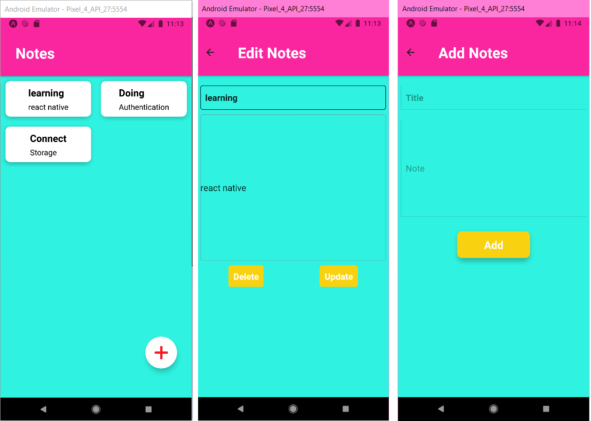

## React Native CRUD with Firestore

**Key tech:**
React Native, Expo, Firestore, CRUD 
 
**In the project directory, you can run:**

1. Change to your web app's Firebase configuration in `config.js` file
2. ### `yarn expo start`
3. ### Hit `a` to run android emulator
   check the app Demo
   
